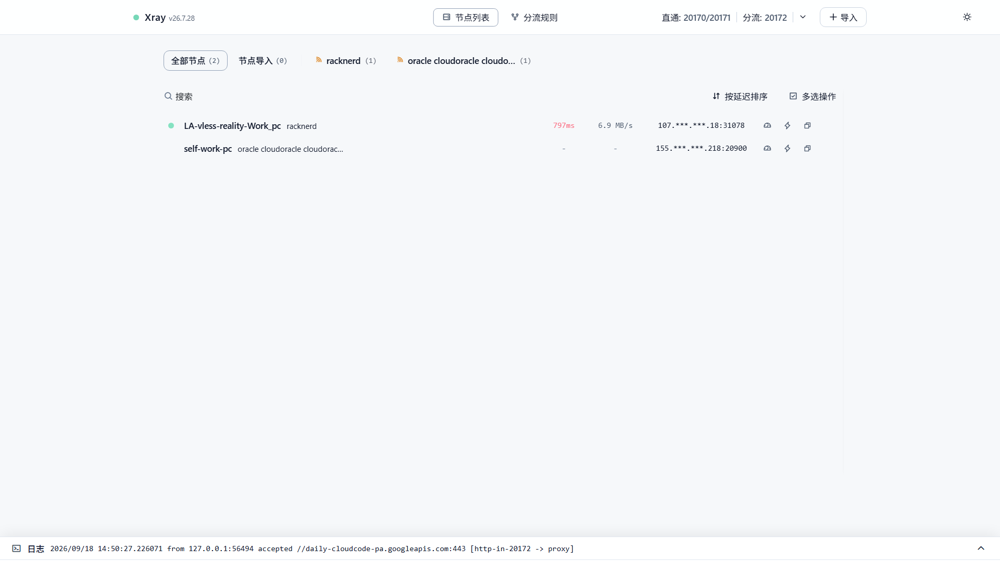
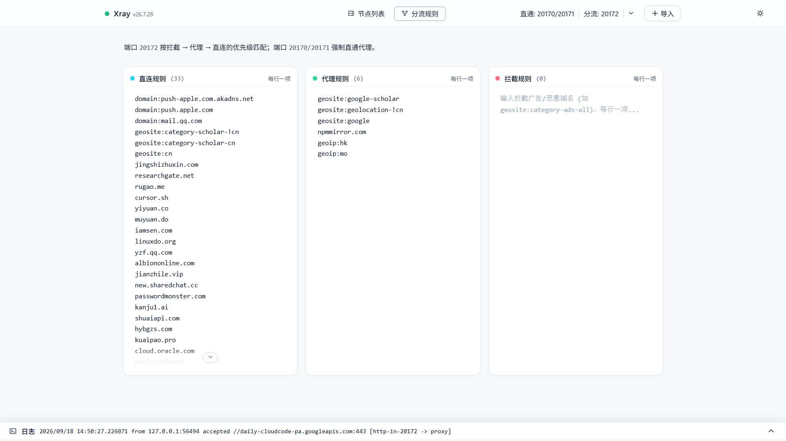

# Xray Web
一个轻量的 Xray-core 本地 Web 控制台，面向 Linux / WSL 环境。
粘贴 3x-ui 等面板生成的分享链接或订阅地址，在浏览器里切换节点、编辑分流、测速、看日志。直接调用本机 Xray-core 二进制，支持 VLESS Reality XHTTP 等最新协议和传输方式。

不依赖 sing-box，不需要 Docker 或 Node.js，不需要 root。

> ⚠️ 本项目仅针对个人自用Windows+WSL环境+自建3x-ui面板导出的订阅/节点轻量开发，可能存在未覆盖的协议组合或不兼容的边界情况。要用的话拉下来让 AI agent 根据你的需求改源码还是很方便的。本项目在pi中使用gemini-3.8-flash-high编写，gpt6-astra-medium进行review，耗时2天左右。
<p align="center">
  <a href="https://mathmonstergo.github.io/xray-web/">
    
  </a>
</p>

## 功能

- **协议**：VLESS、VMess、Trojan、Shadowsocks（含 SS2022、IPv6）
- **传输**：TCP/RAW、WS、gRPC、HTTPUpgrade、XHTTP/SplitHTTP，保留 TLS、Reality、flow、XHTTP extra 等字段
- **测速**：Real Ping 延迟 + 流式下行采样，SSE 实时刷新
- **分流**：直连 / 代理 / 拦截三栏编辑，支持 domain、IP、CIDR、geosite、geoip
- **安全**：默认仅监听 127.0.0.1，严格校验 Host/Origin，阻断跨站请求，可选 Basic Auth
- **运行模式**：支持 systemd 服务模式与内置进程守护模式（`XRAY_RUNTIME_MODE=process`，零 systemd 依赖，适于 Docker / WSL1）

## UI界面

<p align="center">
  
  <br>
  <em>图 1：项目主界面-白</em>
</p>

<p align="center">
  
  <br>
  <em>图 2：规则配置页-白</em>
</p>

## 快速开始

需要 Python 3.10+ 和 [Xray-core](https://github.com/XTLS/Xray-core)。

```bash
git clone https://github.com/mathmonstergo/xray-web.git && cd xray-web
python3 -m venv .venv
.venv/bin/python -m pip install -r requirements.txt
.venv/bin/python scripts/prepare_local.py

# 验证配置
/usr/local/bin/xray run -test -config data/deploy/xray.json

# 安装用户服务
mkdir -p ~/.config/systemd/user
cp data/deploy/xray-web.service data/deploy/xray-web-core.service ~/.config/systemd/user/
systemctl --user daemon-reload
systemctl --user enable --now xray-web
```

打开 http://127.0.0.1:2017 ，右上角导入订阅/节点，双击节点启用代理。
更多操作自行体验~

## 端口

| 端口 | 用途 |
| --- | --- |
| 2017 | Web 控制台 |
| 20170 | SOCKS5 直通代理 |
| 20171 | HTTP 直通代理 |
| 20172 | HTTP 分流代理（经规则匹配） |

## 兼容现有 Xray 服务

已有系统级 Xray 不需要重装。参考 `.env.example` 配置路径即可：

```bash
cp .env.example .env   # 编辑填写实际路径
scripts/start.sh
```

详见 `.env.example` 中的说明。

## 测试

```bash
.venv/bin/python -m pip install -r requirements-dev.txt
.venv/bin/python -m unittest discover -s tests -v
node --test tests/frontend.test.cjs
```

## 致谢

设计参考了 [v2rayA](https://github.com/v2rayA/v2rayA)（端口与分流架构）和 [v2rayN](https://github.com/2dust/v2rayN)（测速逻辑）。感谢 [Xray-core](https://github.com/XTLS/Xray-core)。

## 许可证

[MIT](LICENSE)　·　第三方依赖见 [THIRD_PARTY_NOTICES.md](THIRD_PARTY_NOTICES.md)
